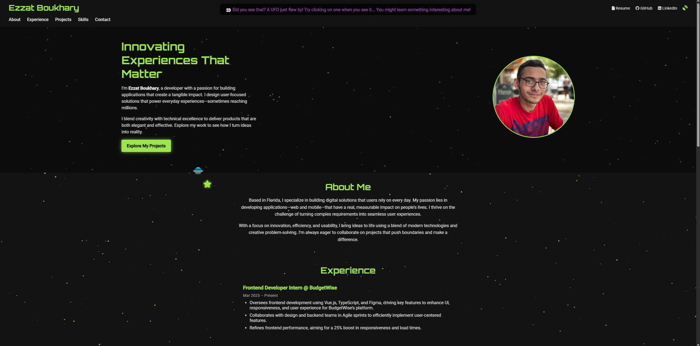
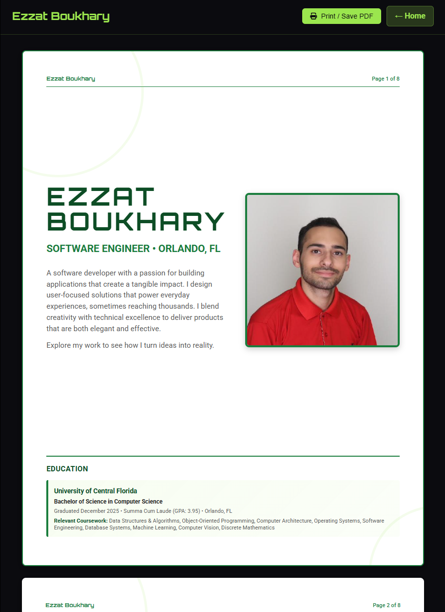

# EzzatBoukhary.github.io

My personal portfolio website, built from scratch with HTML, CSS, and JavaScript.

🌐 **Live Site**: [ezzatboukhary.github.io](https://ezzatboukhary.github.io/)

## What's Inside

- **Landing Page** (`/`) – Space-themed homepage showcasing experience, projects, skills, and recommendations
- **Portfolio** (`/portfolio`) – 8-page PDF-ready document with detailed work history and project breakdowns
- **Resume** (`/resume`) – Live-updating resume viewer with download option
- **Project Pages** (`/projects/*`) – Individual case studies for Puppetry, College Event Platform, Dragonotchi, and KillerBot

## Tech Stack

- HTML5, CSS3, JavaScript (vanilla, no frameworks)
- Canvas API for animated backgrounds
- Intersection Observer for scroll-triggered animations

## Features

- Fully responsive across all devices
- Print-optimized layouts (8.5" × 11" pages)
- Dark theme with custom particle effects
- Semantic HTML with accessibility in mind

## Preview

Landing page:

Portfolio Page:
