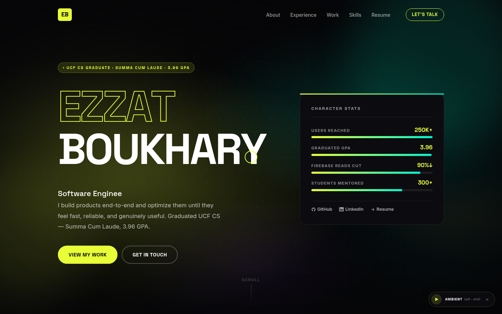
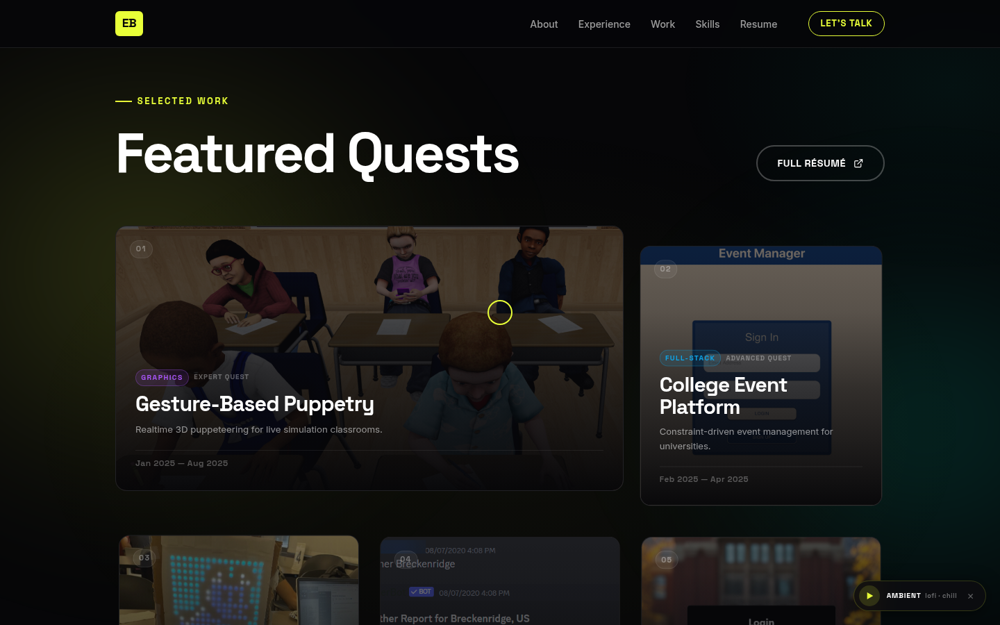
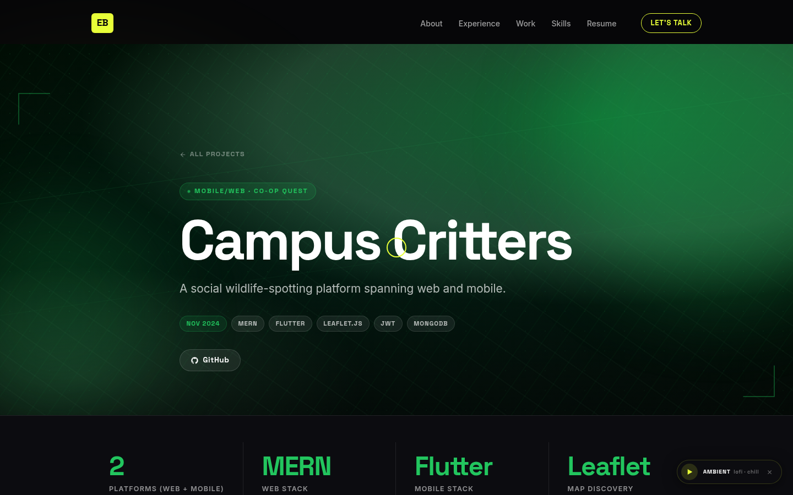
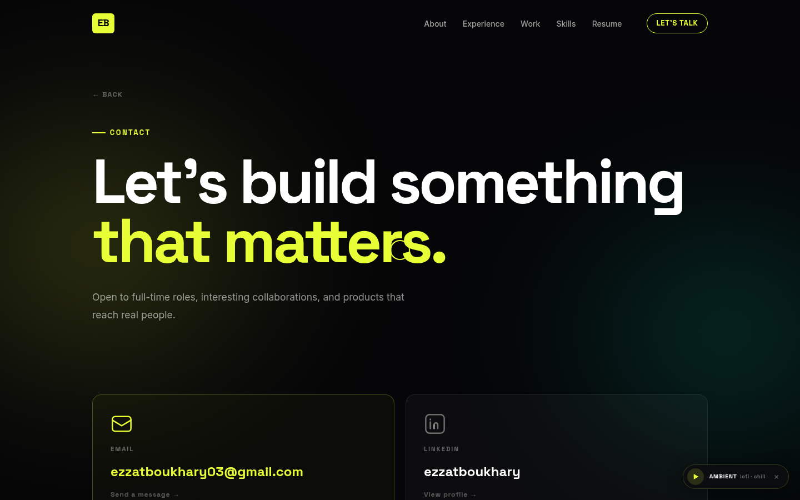

# Ezzat Boukhary — Portfolio

Personal portfolio site built with React, TypeScript, and Vite.

🌐 **Live**: [ezzatboukhary.github.io](https://ezzatboukhary.github.io/)

## Screenshots

| | |
|---|---|
|  |  |
|  |  |

## Tech Stack

- React 18 + TypeScript
- Vite 5
- GSAP 3 + ScrollTrigger
- Lenis (smooth scroll)
- React Router v6
- CSS custom properties / modular stylesheets

## Pages

| Route | Description |
|---|---|
| `/` | Home — hero, experience, projects, skills, recommendations, contact |
| `/project/:slug` | Project case study pages |
| `/resume` | Embedded résumé |
| `/contact` | Contact links |
| `/portfolio.html` | Printable portfolio PDF (use browser Print / Save PDF) |

## Content

All site content — profile info, experience, projects, stats, and recommendations — is managed in `src/data/siteData.ts`.

## Development

```bash
npm install
npm run dev
```

## Build

```bash
npm run build
```
